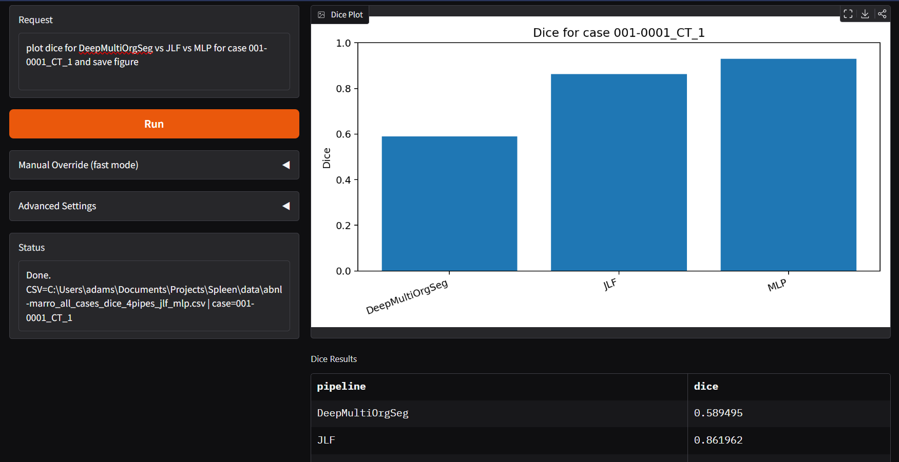

# SpleenArgViz

Natural-language Dice analysis for spleen segmentation experiments.

Project goal: help the research team quickly extract experiment information and plot it in meaningful, reproducible ways.

This project lets lab members type a request like:

- `plot dice for DeepMultiOrgSeg vs JLF vs MLP for case 001-0001_CT_1`

The app/script uses a local Ollama model to extract structured JSON arguments, then loads Dice results and generates:

- a Dice table
- a bar plot

## What This Repo Includes

- `app_gui.py`: local Gradio web app for request -> parsed JSON -> Dice table + plot
- `run_one_case_from_csv.py`: CLI runner using your sweep/result CSV
- `run_one_case.py`: CLI runner using mask files (`gt.nii.gz` + prediction masks)
- `outputs/`: generated plots from GUI
- `data/image/image.png`: example image asset

## Environment Setup

Use Python 3.11.

```bash
pip install -r requirements.txt
```

If `requirements.txt` is missing packages in your environment, install:

```bash
pip install gradio matplotlib pydantic requests nibabel numpy pandas
```

## Ollama Setup

Install Ollama and pull a model:

```bash
ollama --version
ollama pull llama3.2:3b
ollama list
```

Test:

```bash
ollama run llama3.2:3b "Return ONLY JSON: {\"ok\": true}"
```

Default API URL used by app/scripts:

- `http://localhost:11434/api/generate`

## Data Requirement (CSV Mode)

Recommended mode for this lab: run from existing Dice CSV.

Expected CSV columns:

- `dataset`
- `case`
- pipeline Dice columns (e.g., `DeepMultiOrgSeg`, `GennUNet`, `NVSegmentCT`, `TotalSegmentator`, `JLF`, `MLP`)
- `best_pipeline`
- `best_dice`

Current lab path:

- Windows: `C:\Users\adams\Documents\Projects\Spleen\data\abnl-marro_all_cases_dice_4pipes_jlf_mlp.csv`
- WSL: `/mnt/c/Users/adams/Documents/Projects/Spleen/data/abnl-marro_all_cases_dice_4pipes_jlf_mlp.csv`

## Run (CLI, CSV Mode)

From `SpleenArgViz`:

```bash
python run_one_case_from_csv.py --model llama3.2:3b --request "plot dice for DeepMultiOrgSeg vs JLF vs MLP for case 001-0001_CT_1 and save figure"
```

Output:

- `dice_one_case_from_csv.png`
- console Dice scores

## Run (GUI Mode)

From `SpleenArgViz`:

```bash
python app_gui.py
```

Open:

- `http://127.0.0.1:7861`

In GUI:

1. Set CSV path (Windows path in Windows terminal; WSL path in WSL terminal)
2. Enter request, or use Manual Override (`case` + comma-separated pipelines)
3. Click `Run`

Output:

- parsed JSON
- Dice table
- plot image saved to `outputs/`

## Reproducibility Notes

- Use the same model (`llama3.2:3b`) for consistent parsing behavior.
- Keep CSV headers unchanged (column names drive pipeline lookup).
- Keep case IDs exact (string match on `case` column).
- Save representative GUI/CLI output PNGs under `outputs/` for reports.

## Example Image


